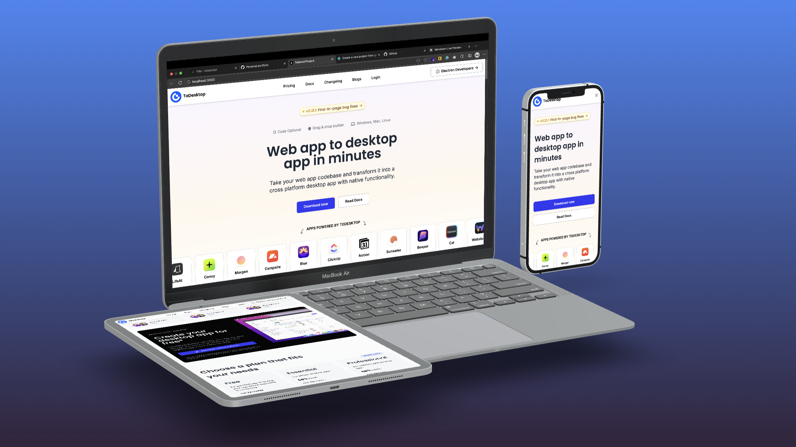

# ToDesktop - Transform Web Apps to Desktop
A modern, responsive landing page built with **Tailwind CSS** showcasing Frontend skills.



## 🚀 Features

- **Responsive Design** - Mobile-first approach with breakpoints for different screen sizes
- **Modern UI** - Clean and professional design using Tailwind utility classes
- **Interactive Elements** - Smooth hover effects and mobile menu functionality
- **Custom Styling** - Custom color palette and typography configuration

## 🛠️ Technologies Used

- **HTML5** - Semantic markup
- **Tailwind CSS** - Utility-first CSS framework
- **JavaScript** - Interactive functionality
- **Font Awesome** - Icon library

## 📦 Installation

1. Clone the repository
```bash
git clone <repository-url>
cd tailwind-landing-page
```

2. Install dependencies
```bash
npm install
```

3. Build Tailwind CSS
```bash
npm run build
```

4. Open `index.html` in your browser.

